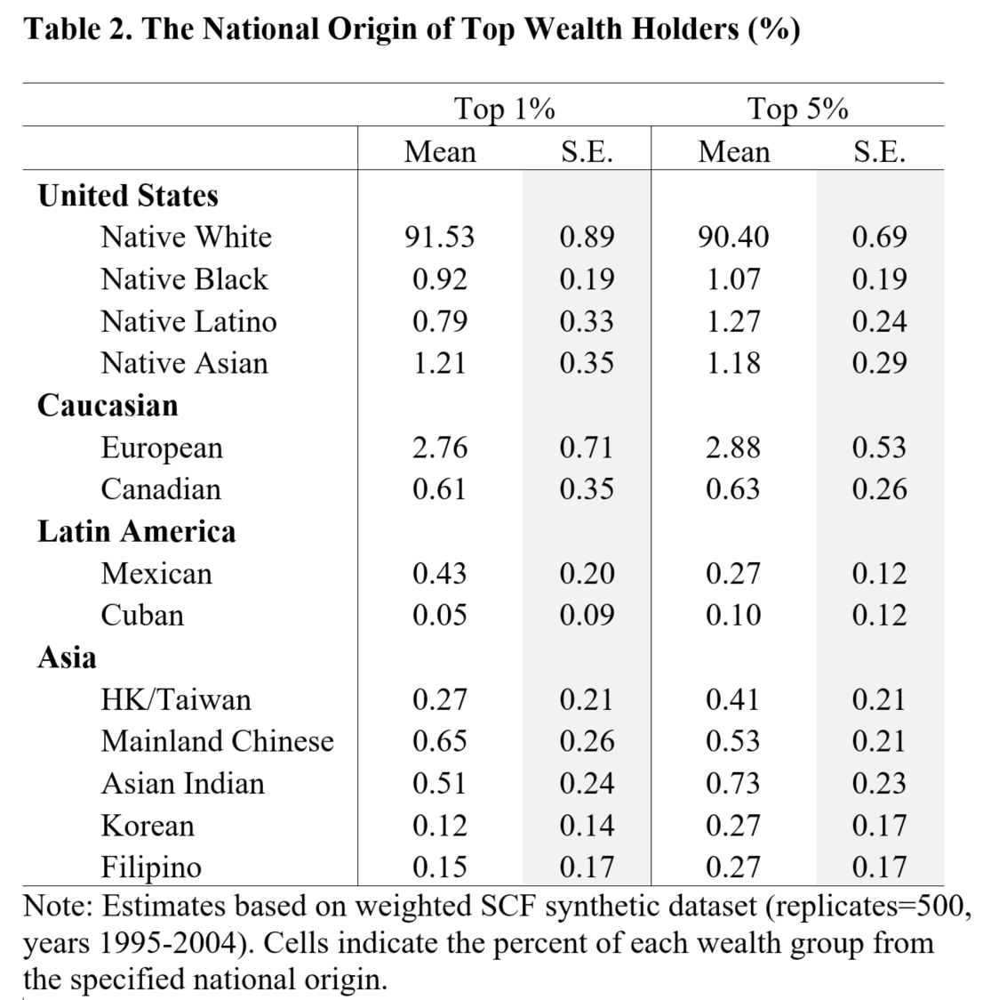

Ethnicity in 1%
=====

  

About
-----
This repository was written in 2016 and was used to publish [this paper](https://journals.plos.org/plosone/article?id=10.1371/journal.pone.0172876). It examines the national origin of affluent households. Because no single survey dataset contains top wealth holders and data about country of origin, this repository uses two publicly-available data sets: the Survey of Consumer Finances (SCF) and the Survey of Income and Program Participation (SIPP). Multiple imputation is used to impute country of birth from the SIPP into the SCF and descriptive statistics are used to estimate the prevalence of immigrants among top wealth holders. Results indicate that significant numbers of top wealth holders who are usually classified as white natives may be immigrants.
